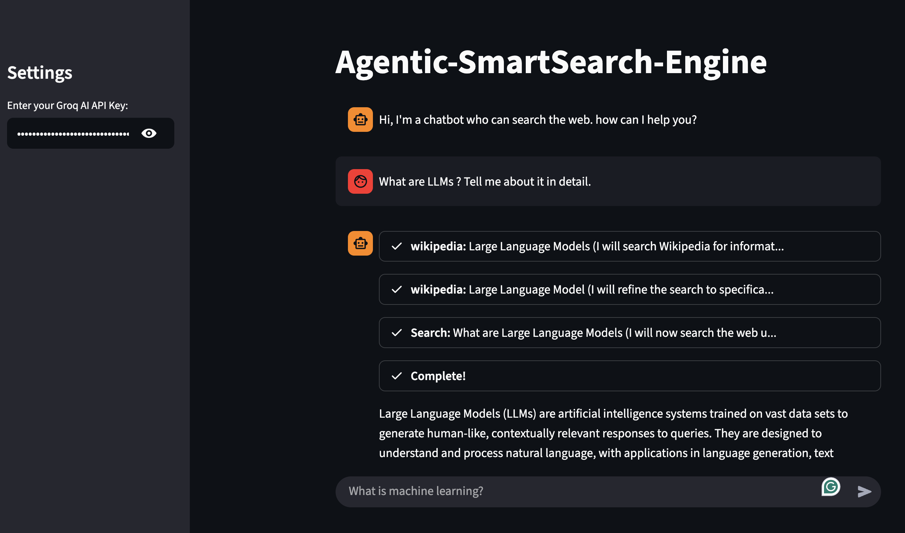

# 🚀 Agentic-SmartSearch-Engine

> **A Streamlit-based intelligent search assistant** that combines **LLM reasoning** with curated external tools (DuckDuckGo, Arxiv, Wikipedia) to give you smart, up-to-date answers.


## 🖥️ Demo



---

## 📂 Project Structure

```
│
├── app.py # Main Streamlit app – runs the LLM search engine
├── requirements.txt # Python dependencies
├── .gitignore # Files & folders to ignore in Git
├── README.md # Project documentation
├── tools_agents.ipynb # Jupyter Notebook – shows how tools & agents are built
│
├── images/ # Project assets & demo screenshots
│ └── demo1.png # Demo image used in the README
│
```

---

## ✨ What It Does

- 🧠 **Agentic Reasoning:** Uses [LangChain Agents](https://docs.langchain.com/) to decide which search tool to call.
- 🌐 **Multi-Source Search:**  
  - 🔎 **DuckDuckGo** – real-time web results  
  - 📚 **Arxiv** – scientific papers  
  - 📖 **Wikipedia** – general knowledge
- ⚡ **Streaming Responses:** Real-time token streaming in the chat window.
- 🔑 **Bring Your Own API Key:** Works with your **Groq AI API key** for low-latency, high-quality LLM calls.
- 🖥️ **Simple UI:** Clean chat-style interface with a sidebar for key settings.

---

## 🛠️ Tech Stack

- [Streamlit](https://streamlit.io/) — frontend web app
- [LangChain](https://www.langchain.com/) — agent orchestration
- [ChatGroq](https://groq.com/) — LLaMA-3.3-70B-Versatile model
- [DuckDuckGoSearchRun](https://python.langchain.com/docs/modules/tools/) — web search tool
- [ArxivAPIWrapper / WikipediaAPIWrapper](https://python.langchain.com/docs/modules/tools/) — academic + general sources
- **Python 3.8+** with `dotenv` for environment variables

---

## ⚙️ Installation & Setup

1. **Clone the repo**
```bash
git clone https://github.com/your-username/Agentic-SmartSearch-Engine.git
cd Agentic-SmartSearch-Engine
```

2. **Create & activate a virtual environment (Mac / Linux)**
   ```bash
   python3 -m venv venv
   source venv/bin/activate
   ```

3. Install dependencies
   ```bash
   pip install -r requirements.txt
   ```
4. Run the app
   ```bash
   streamlit run app.py
   ```

---

## 🖥️ Usage

- Type a question such as:
  - "Summarize the latest Arxiv papers on reinforcement learning"
  - "Who won the Nobel Prize in Physics 2024?"
- The agent decides whether to search web, Arxiv, or Wikipedia, then streams the answer back.

---

## 📓 Notebook Included

- tools_agents.ipynb — A Jupyter notebook showcasing how each tool & agent works before being integrated into the app.
